# Ecuador Economic Analysis — Data Analysis Portfolio

Two data-driven research projects analysing Ecuador's economic development over four decades. Each project involved sourcing macroeconomic datasets, cleaning and structuring the data, building visualisations in Excel, and drawing evidence-based conclusions from multi-indicator analysis.

---

## Project 1: Economic Growth, Poverty & Inequality (1980–2023)

**Research Question:** How has economic growth influenced poverty and inequality in Ecuador across four decades of political and monetary shifts?

### What I Did

#### Data Collection & Preparation

- Sourced time-series data from the World Bank World Development Indicators, World Inequality Database, and IndexMundi covering 1980–2023
- Extracted and structured datasets for: Gini coefficient, poverty headcount ratios ($2.15/day threshold), GDP growth (annual %), GDP per capita, inflation rates (consumer prices), and national income distribution (top 10% vs bottom 50%)
- Cross-referenced data across multiple sources (World Bank, ECLAC, UNDP, IMF) to validate figures and fill gaps

#### Analysis

- Tracked inequality trends through the Gini coefficient, identifying a decline from 53.35 to 45.02 (2007–2017) coinciding with redistributive policy reforms
- Measured poverty rate changes across policy eras: neoliberal period (1980–2000), dollarisation (2000–2007), and Correa-era redistribution (2007–2017)
- Compared GDP growth volatility — averaging 2% annually in the 1990s vs 4.5% post-dollarisation (2000–2016)
- Mapped inflation trajectory from hyperinflation peak (96–108% in 2000) through stabilisation to single digits by 2003
- Benchmarked Ecuador's inflation against Colombia to contextualise the impact of dollarisation

#### Visualisations (Excel)

Built 6 charts covering inequality, poverty, GDP, inflation, and income distribution.

| Inequality Trend (Gini Coefficient 1987–2023) | Inflation: Ecuador vs Colombia |
|:---:|:---:|
| 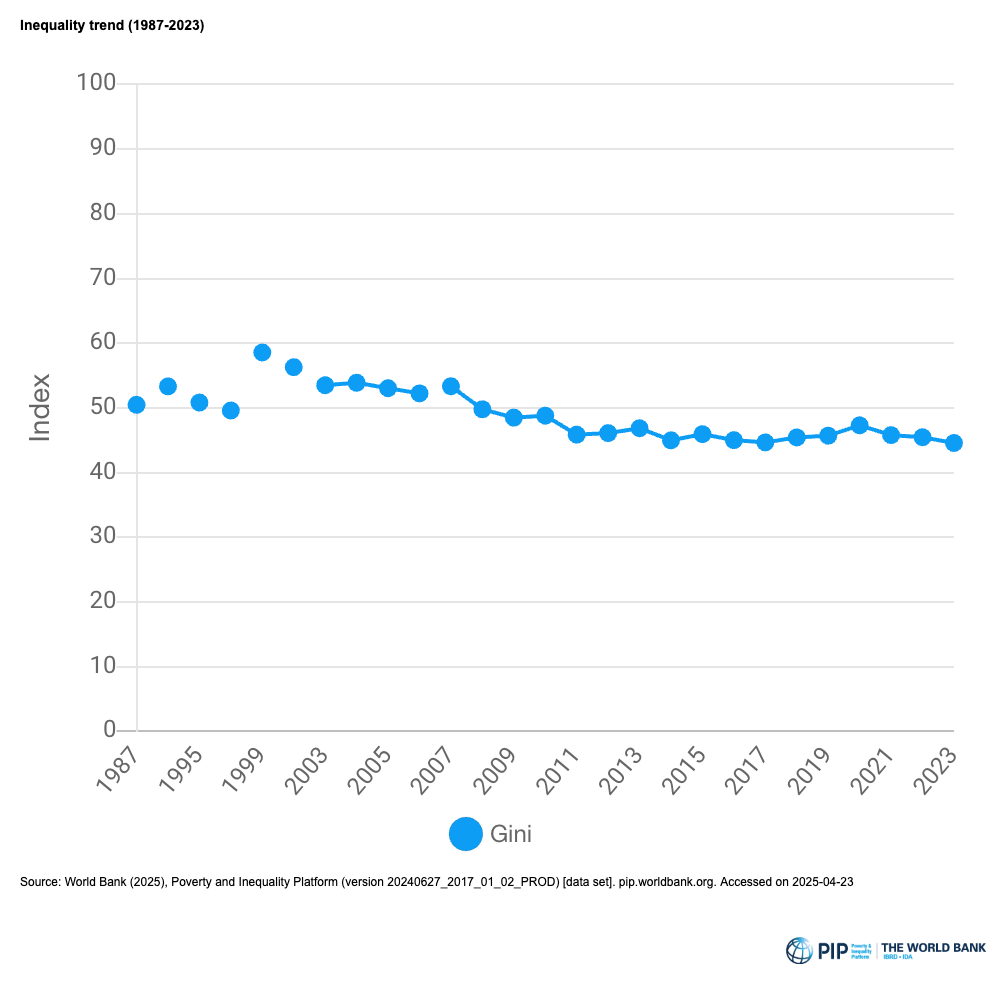 | 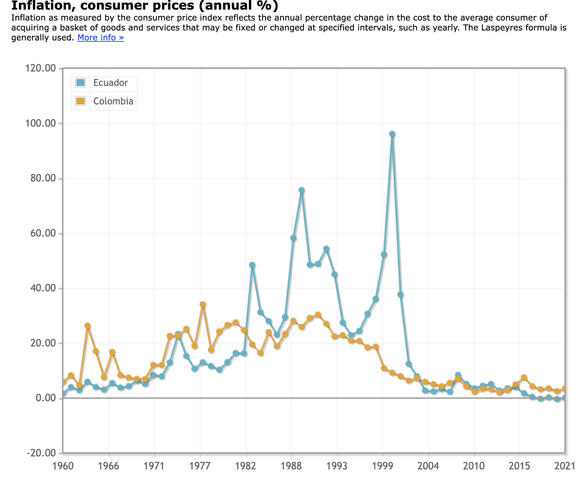 |

| GDP Growth Comparison (Peru, Ecuador, Colombia) | Poverty Rate & Population Living in Poverty |
|:---:|:---:|
| 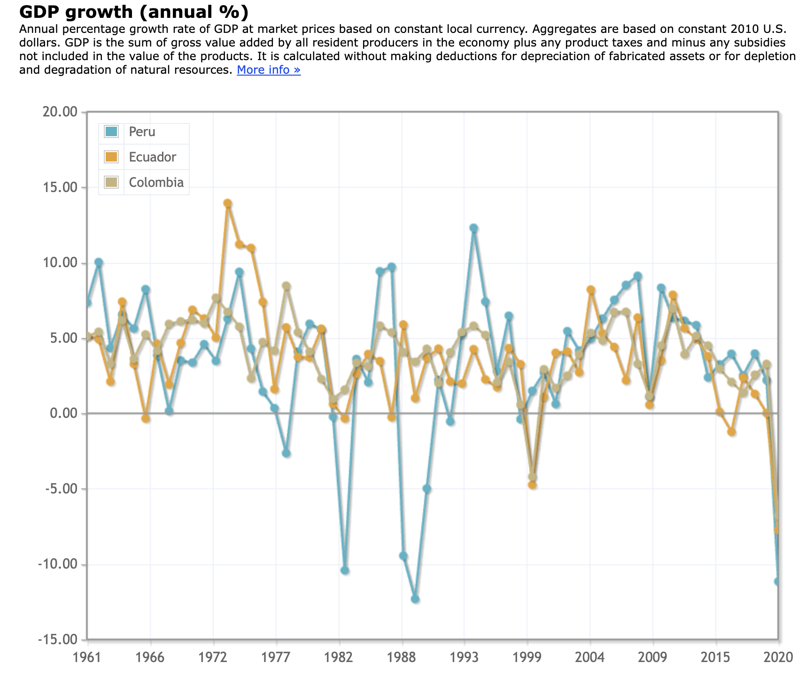 | 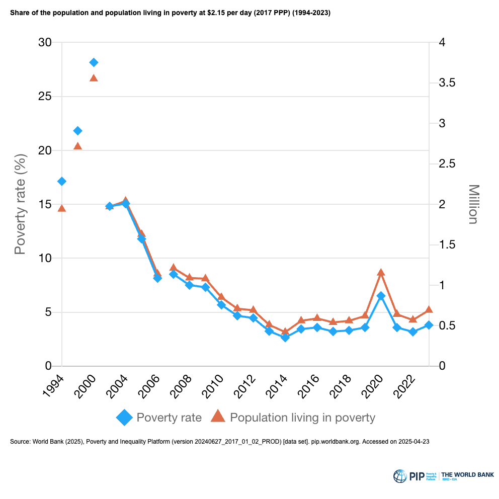 |

| Unemployment Rate (Historical) | Groups in Bottom 40 and Top 60 (2023) |
|:---:|:---:|
| 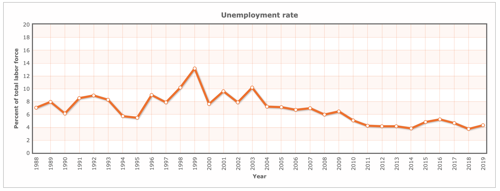 | 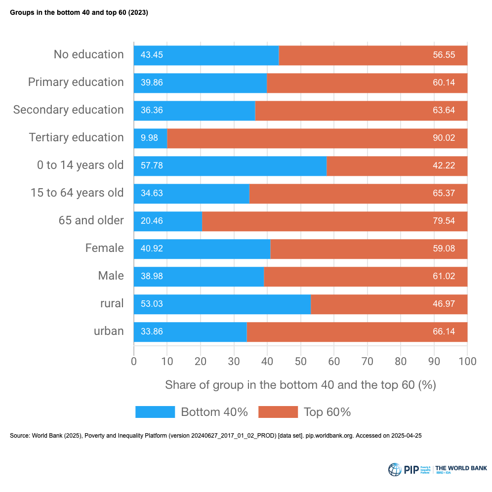 |

#### Key Findings

- Economic growth alone was insufficient for sustained poverty reduction
- Targeted redistributive policies (cash transfers, public healthcare, free education) produced measurable inequality reduction — Gini dropped 8 points in a decade
- Structural disparities by ethnicity and geography persisted despite aggregate improvement
- Oil price dependency made gains fragile — poverty rates in rural provinces doubled after the 2014 oil price collapse

📄 **Full paper:** [Ecuador\_Growth\_Poverty\_Inequality\_Analysis.docx](papers/Ecuador_Growth_Poverty_Inequality_Analysis.docx)

---

## Project 2: Was Dollarisation a Success? — Indigenous Inequality Under Monetary Reform

**Research Question:** Did Ecuador's adoption of the US dollar (2000) address or deepen socioeconomic disparities for indigenous and rural communities?

### What I Did

#### Data Collection & Preparation

- Built comparative datasets from World Bank (2024) development indicators spanning 1975–2024
- Collected and structured data for: GDP growth (annual %), consumer price inflation (annual %), poverty rates disaggregated by national/urban/rural, and unemployment rate (% of labour force)
- Sourced supplementary ethnographic and social data from ECLAC, UNDP, Overseas Development Institute, and academic literature
- Compiled cross-country comparison data for Panama and El Salvador (also dollarised economies) to benchmark outcomes

#### Analysis

- Disaggregated national poverty data into urban vs rural to expose uneven post-dollarisation recovery — urban extreme poverty fell to 4–6% while rural remained in double digits through 2014
- Built stacked bar charts comparing moderate vs extreme poverty across national, urban, and rural populations at five time points (1995, 1998, 1999, 2006, 2014)
- Created a custom inequality framework diagram mapping four dimensions: income, education access, healthcare access, and financial inclusion
- Annotated GDP time series with the dollarisation event (2000) to show pre/post trajectory
- Cross-referenced indigenous poverty rates (40%+) against the national average (25%) and informal employment data (70%+ without social protection)
- Drew AS-AD diagram to illustrate the 2000 hyperinflation crisis mechanism

#### Visualisations (Excel)

| GDP Growth with Dollarisation Marker | National Poverty (Moderate vs Extreme) |
|:---:|:---:|
| 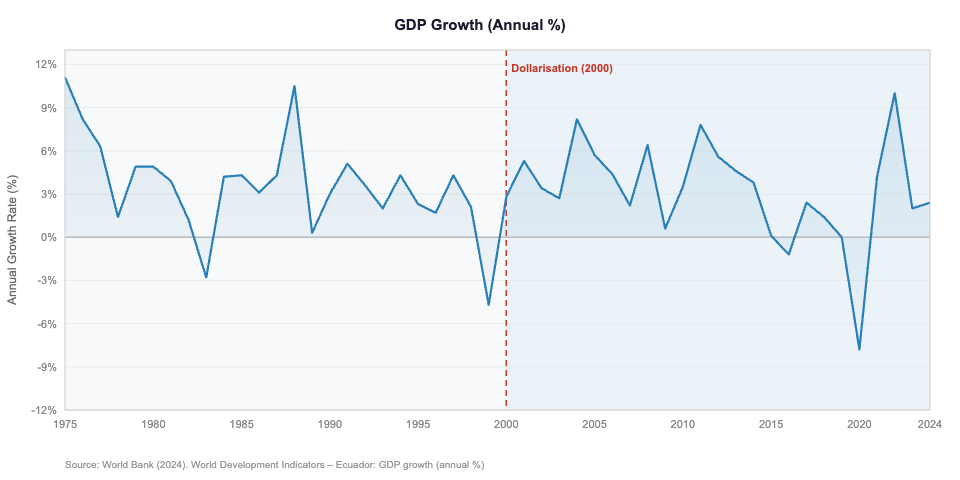 | 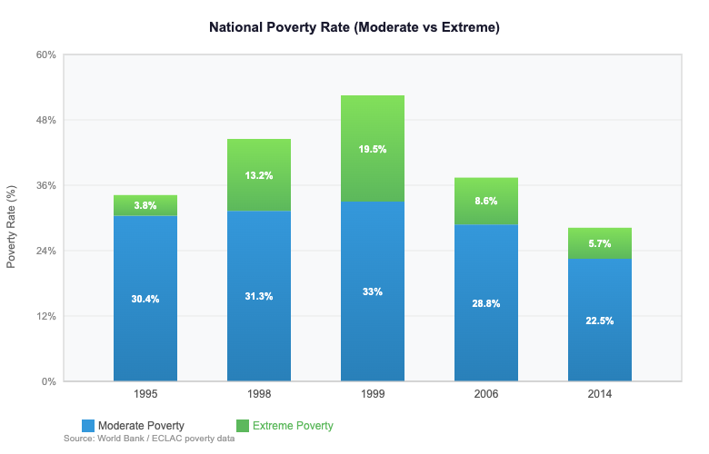 |

| Urban Poverty Rates | Rural Poverty Rates |
|:---:|:---:|
| 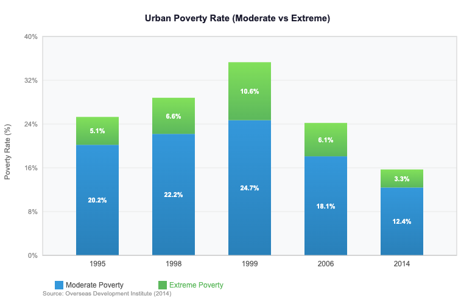 | 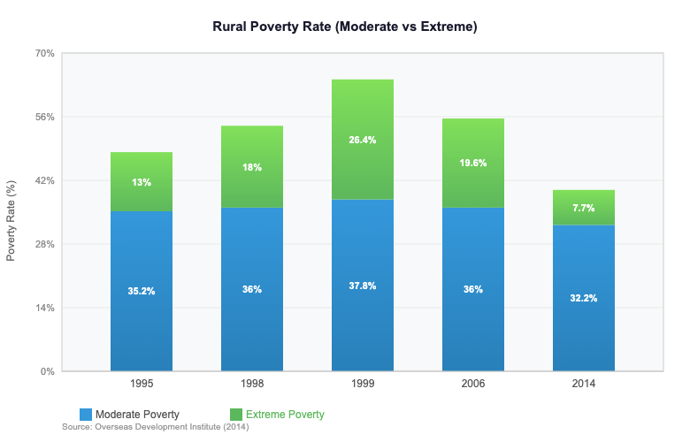 |

| Inflation Stabilisation Post-Dollarisation | Unemployment Rate |
|:---:|:---:|
| 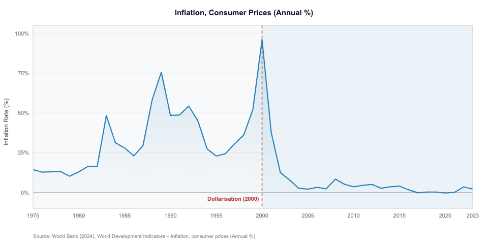 | 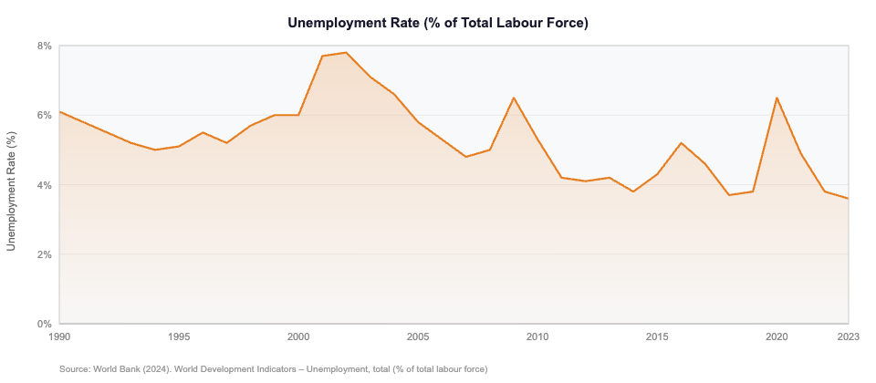 |

#### Key Findings

- Dollarisation stabilised inflation rapidly (96.1% → 7.9% within three years) and restored market confidence
- Benefits concentrated in urban formal-sector economies — rural and indigenous communities saw limited improvement
- Stacked bar analysis revealed urban poverty fell roughly in half while rural poverty barely moved, with extreme poverty persisting at much higher rates in rural areas
- Pattern replicated in Panama and El Salvador — macroeconomic stability achieved alongside deepening structural inequality
- Loss of monetary policy tools left Ecuador unable to respond to localised economic shocks affecting vulnerable populations

📄 **Full report:** [Ecuador\_Dollarisation\_Indigenous\_Inequality\_Report.docx](papers/Ecuador_Dollarisation_Indigenous_Inequality_Report.docx)

---

## Skills Demonstrated

| Skill | Detail |
|---|---|
| Data Sourcing | World Bank WDI, IndexMundi, World Inequality Database, ECLAC, UNDP, IMF, ODI |
| Data Preparation | Extracting, cleaning, and structuring multi-source time-series data for analysis |
| Excel | Data organisation, formula-based calculations, chart creation (line graphs, stacked bar charts, comparative multi-series plots) |
| Analysis Techniques | Time-series trend analysis, cross-country benchmarking, poverty decomposition (urban/rural/ethnic), pre/post policy impact comparison |
| Data Visualisation | Annotated time-series charts, stacked bar comparisons, multi-indicator dashboards, custom framework diagrams |
| Research & Synthesis | Integrating quantitative data with theoretical frameworks (Kuznets Curve, Pro-Poor Growth, Dual Economy, Dependency Theory) to support evidence-based conclusions |
